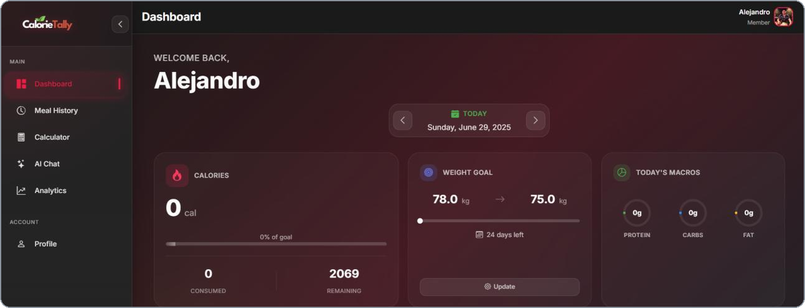
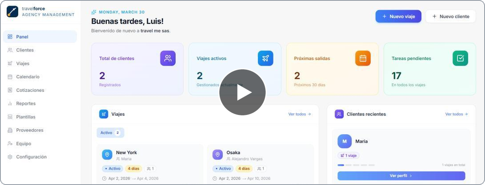
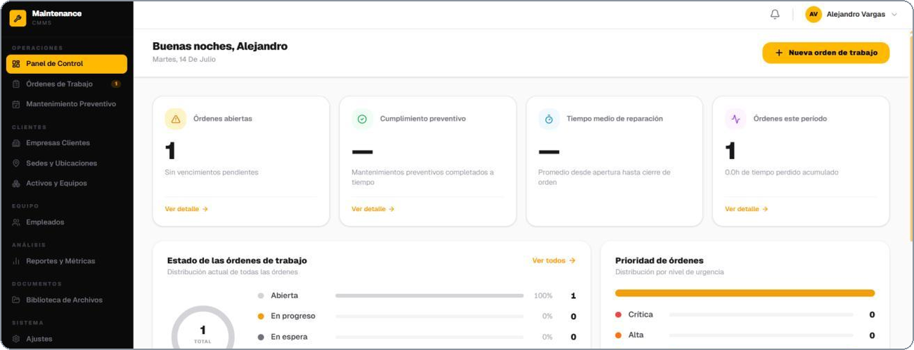
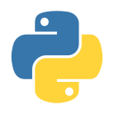
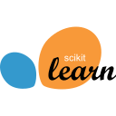

# Alejandro Vargas

**Software Engineer · AI/ML and Full-Stack**

15+ years shipping production systems: genomic sequencing pipelines for clinical labs in Japan, multi-tenant SaaS platforms built end to end, and machine learning that reaches production instead of staying in a notebook.

Spanish (native) · English (C1, IELTS 7) · Japanese (JLPT N3)

<a href="https://alejandrovargas.co"><b>alejandrovargas.co</b></a>&nbsp; ·&nbsp; <a href="https://linkedin.com/in/luis-alejandro-vargas-ramos/"><b>LinkedIn</b></a>

 

<table width="100%">
<tr>
<td width="33.33%" valign="top" align="center">

  
<b><a href="https://calorietally.com">CalorieTally</a></b>
 
Log a meal by typing it, saying it, or photographing it. The AI handles the nutrition.
</td>
<td width="33.33%" valign="top" align="center">

  
<b><a href="https://travelforce.app">Travelforce</a></b>
 
Trip planning, itineraries and quotes for travel agencies, each drafted first by AI.
</td>
<td width="33.33%" valign="top" align="center">

  
<b><a href="https://operx.pro">OperX</a></b>
 
Work orders for maintenance crews, built to keep working where there is no signal.
</td>
</tr>
</table>

Also building <b>Documenty</b>, a multi-tenant RAG platform for querying large private document sets.

 

**Backend**

&nbsp;&nbsp;&nbsp;
&nbsp;&nbsp;&nbsp;
&nbsp;&nbsp;&nbsp;
&nbsp;&nbsp;&nbsp;
&nbsp;&nbsp;&nbsp;

**Frontend**

&nbsp;&nbsp;&nbsp;
&nbsp;&nbsp;&nbsp;
&nbsp;&nbsp;&nbsp;

**Machine learning and AI**

&nbsp;&nbsp;&nbsp;
&nbsp;&nbsp;&nbsp;
&nbsp;&nbsp;&nbsp;
&nbsp;&nbsp;&nbsp;
&nbsp;&nbsp;&nbsp;

**Data and infrastructure**

&nbsp;&nbsp;&nbsp;
&nbsp;&nbsp;&nbsp;
&nbsp;&nbsp;&nbsp;
&nbsp;&nbsp;&nbsp;
&nbsp;&nbsp;&nbsp;
&nbsp;&nbsp;&nbsp;
&nbsp;&nbsp;&nbsp;

**Bioinformatics**

Oxford Nanopore · Dorado · Biopython · pysam · samtools · Octopus · WhatsHap

 

The fastest way to reach me is <a href="mailto:hello@alejandrovargas.co"><b>hello@alejandrovargas.co</b></a>

